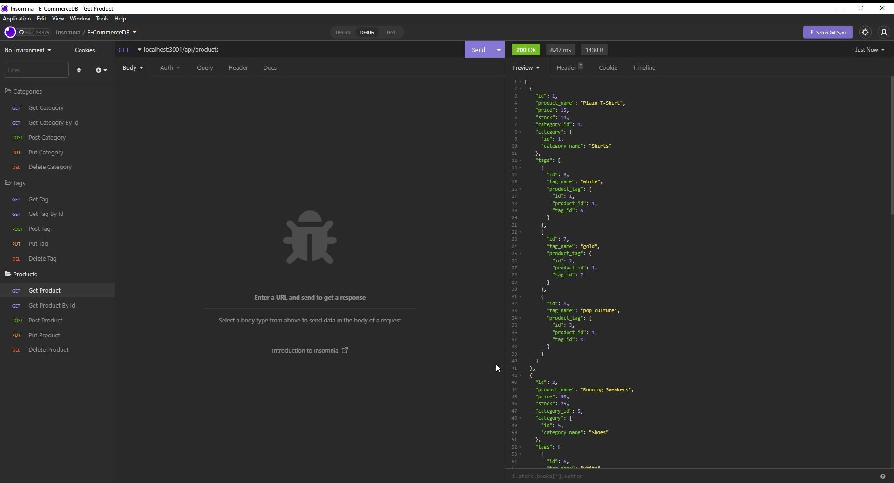

# E-CommerceDB

## Description

This project is an example of a back-end API for an e-commerce retailer. Using Node.js, Express.js, MySQL, and Sequalize this project lets you interact with the back-end using routes in order to get, post, put, and delete categories, product tags, and products so as a company you could manage your online retail.

## Table of Contents

- [Installation](#installation)
- [Usage](#usage)
- [Credits](#credits)
- [License](#license)
- [Questions](#questions)

## Installation

If you do not have Node.js installed, first go to the [Node.js website](https://nodejs.org/en/) and follow the instructions to install Node.js. Once you have Node.js Installed or if you already had it on your machine use git to clone the project repository from GitHub. After cloning, run 'npm i' or 'npm install' from the command line in the directory of the project to install all neccessary dependencies for this project. Use the schema file found in the db directory to create the database and optionally the seeds file to seed the database with examples. Rename the .env.EXAMPLE file by removing the .EXAMPLE from the name and fill out the enviroment variables contained within the file. You will also need an API testing platform such as [Insomnia](https://insomnia.rest/) or [Postman](https://www.postman.com/) in order to test the routes to the API.

## Usage

After installation, navigate to the main directory of this project using your terminal. Then run 'npm start' or 'node server.js' to start the app. Then using an API testing platform as mentioned in the installation above, you will route your requests to localhost:3001/api. After the api in the route use /categories, /tags, or /products to make request to categories, tags, or products respectively. From there you can use a get request for each route in order to get all categories, tags, or products and optionally use another / followed by any id to get a specific id. Post to those routes with JSON to add data. Use a put request for each of those routes with a / followed by the id of what you want to update using JSON. Finally delete any data by using a delete request on a route followed by a / and the id you want to delete.

Watch the walkthrough demo below by following the link.

[E-CommerceDB walkthrough demo video](https://drive.google.com/file/d/1WtYXqiuowRrThKnQQtzNK7CzDQ8Lpqmi/view?usp=sharing)

## Credits

#### Third-Party Assets

- [Node.js](https://nodejs.org/en/)
- [mySQL](https://www.mysql.com/)
- [Express.js](https://expressjs.com/)
- [Sequelize](https://sequelize.org/)
- [nodemon](https://nodemon.io/)
- [mySQL2](https://github.com/sidorares/node-mysql2)
- [dotenv](https://github.com/motdotla/dotenv)

## License

This project is not licensed.

## Questions

You can find me here:

- GitHub: [PierTwo](https://github.com/PierTwo)
- Email: <latasnoah@gmail.com>
